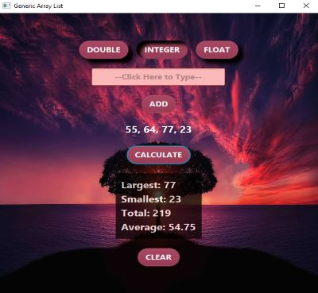

<h1 align="center">Welcome to Generic Array List1</h1>

<!--  -->

<h4 align="center">
  Javafx: clicking either the double, integer, or float button will define what
  number type is to be used. The add button will pass the typed in value to
  a generic class.. The calculate	button will display largest, smallest,
  total and average of the array.
</h4>
 

<h2 align="center">_Using this GUI is as follows:_</h2>

<h4 align="center">
    1. Click on either DOUBLE, INTEGER or FLOAT to select the data type.

  <!--  -->
</h4>

<h4 align="center">
    2. Click in the text box to start typing in a number.

  <!--  -->
</h4>

<h4 align="center">
    3. Either click the ADD button or press enter on the keyboard will add the value to the array list.

  <!--  -->
</h4>

<h4 align="center">
    4. Repeat steps 2 and 3 until you are satisfied with how many values are in the array list.
   
    As items are added, they will be displayed.

  <!--  -->
</h4>

<h4 align="center">
    5. Press the CALCULATE button will display the largest, smallest, total and average from the array list.
    

    <!--  -->
</h4>

<h4 align="center">
    6. Pressing the CLEAR button will empty the array list allowing you to start over.

    <!--  -->
</h4>

<h2 align="center">_Errors_:</h2>

<h4 align="center">
    1. A number type has not been selected. Please select a number type (DOUBLE, INTEGER, FLOAT).

    <!--  -->
</h4>

<h4 align="center">
    2. No value has been typed in to add to the array list.  Please type in a value.

    <!--  -->
</h4>

<h4 align="center">
    3. If the value does not match the selected number type, try again.  For instance, "Hello World"
    is a string and not a DOUBLE, INTEGER, or FLOAT.

    <!--  -->
</h4>

<!-- For more details see [GitHub Flavored Markdown](https://guides.github.com/features/mastering-markdown/). -->
<!-- You can use the [editor on GitHub](https://github.com/zuki07/Generic_array_list1/edit/gh-pages/index.md) to maintain and preview the content for your website in Markdown files. -->
